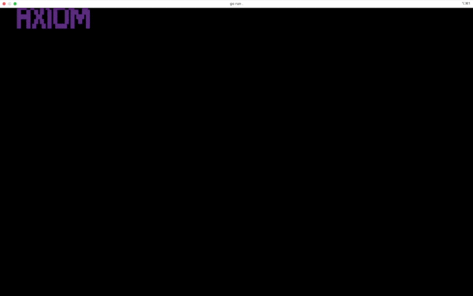

# A(xiom) CLI

Subset of Axiom UI features running in the terminal.

# Req'd env vars

```
export AXIOM_TOKEN=<axiom personal token>
export AXIOM_ORG_ID=<taken from axiom settings page>
export AXIOM_URL=<e.g. https://api.dev.axiomtestlabs.co>
```

# Running

```sh
go get .
cd src
go run .
```

